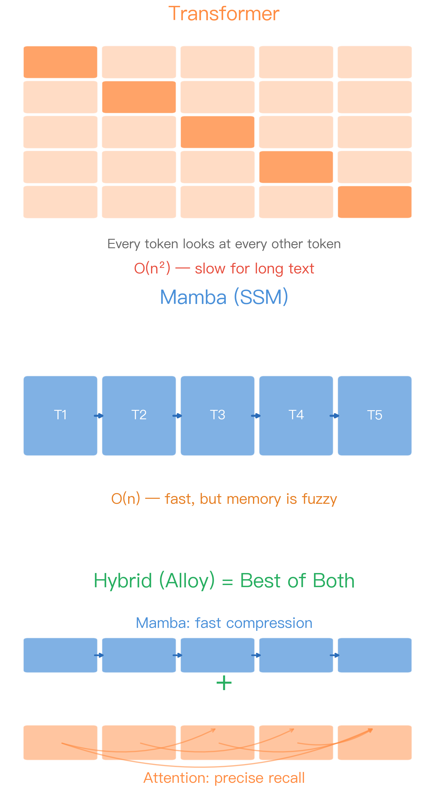
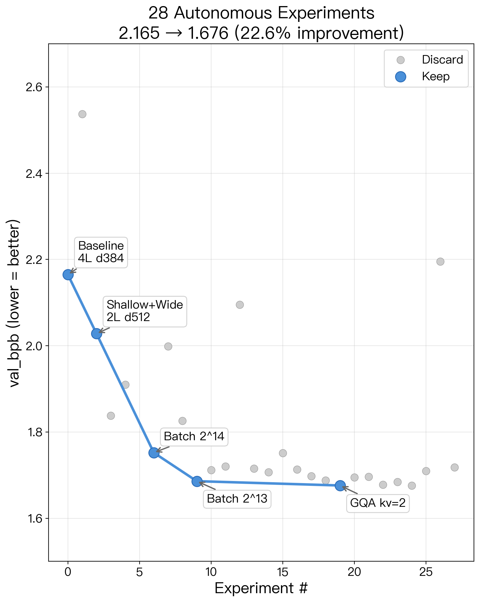
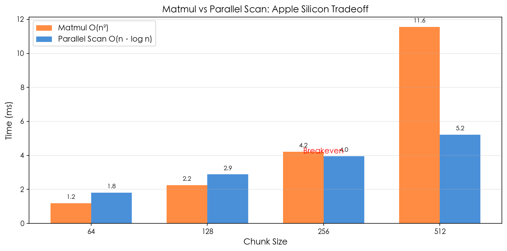
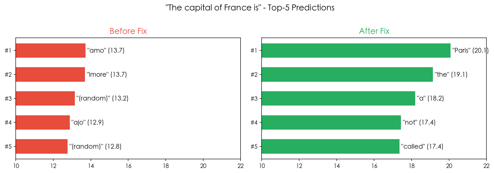
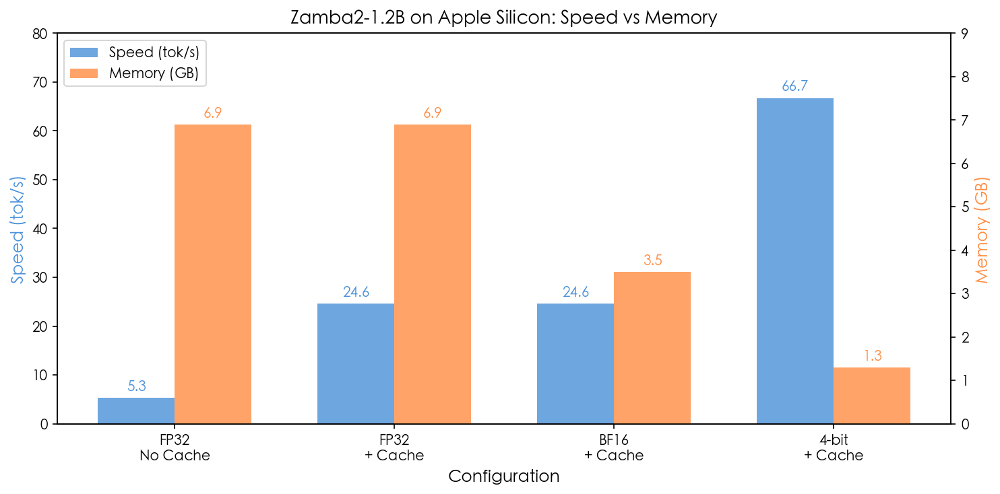

# GPU 买不起？用 Mac 也能跑大模型——从零搭建 Hybrid SSM 推理引擎

> 12 亿参数，1.3 GB 内存，66.7 tok/s。从零开始到 `pip install` 可用，中间经历了 28 次自动实验、4 个隐蔽 bug、和一个关于硬件的反直觉发现。

---

## 为什么做这件事

如果你关注过大模型，可能听过一个名字：**Transformer**。GPT、Claude、Llama 背后都是它。

Transformer 有个核心操作叫"注意力机制"——简单说，就是让文本中的每个字都去"看"其他所有字，找出谁跟谁有关系。

这个设计很强大，但有个致命问题：**文本越长，越慢。** 因为每个字都要看其他所有字，计算量是文本长度的平方。1000 个字看 1000 个字，就是 100 万次计算。10000 个字？1 亿次。

去年，一种叫 **Mamba** 的新架构火了。它用了完全不同的思路——不让每个字看其他所有字，而是维护一个"压缩记忆"，每个字只需要更新这个记忆，然后传给下一个字。**计算量变成了线性的**——文本长 10 倍，只慢 10 倍，而不是 100 倍。

但 Mamba 也有弱点：它的记忆是"模糊"的。你让它回忆一篇长文章开头的某个细节，它经常答不上来。而 Transformer 的注意力机制恰好擅长这种精确回忆。

于是有人想到：**把两者混着用。** 大部分层用 Mamba（快），关键位置插几层注意力（准）。这就是 **Hybrid（混合）架构**。



*从上到下三种架构：Transformer——每个 token 都要看所有其他 token，像一张密集的关系网，越长越慢。Mamba——信息像流水一样一个接一个往前传，快但容易丢细节。Hybrid——上面的流水线负责快速压缩，下面的连接负责精确回忆，取长补短。*

问题是：这些混合模型的实现全是 PyTorch + NVIDIA GPU 的。**Mac 用户被排除在外。**

所以我决定用苹果的 MLX 框架，从零做一个。

---

## 怎么做的

### 第一步：搭积木

整个模型就两种"积木"交替堆叠：

- **Mamba 块**——负责快速处理，维护"压缩记忆"往前传
- **注意力块**——负责精确回忆，在关键位置"回头看"

配置很灵活。比如 12 层模型，只在第 3、7、11 层放注意力块，其余全是 Mamba 块，比例 3:1。Mamba 层多 = 快，注意力层多 = 准。怎么找最佳比例？这就引出了下一步。

### 第二步：让 AI 自己找最优配置

手动调参太慢了。正好 Andrej Karpathy（前 Tesla AI 总监、OpenAI 创始成员）最近开源了一个叫 **autoresearch** 的项目——让 AI 自己做研究，火遍了整个 AI 社区。我把它移植到了 MLX 上，用来自动搜索最优的混合架构配置。原理很简单：

1. AI 自动改模型配置（层数、大小、学习率等）
2. 训练 5 分钟
3. 看效果好不好
4. 好就保留，不好就回滚
5. 循环往复，不需要人盯

**28 轮实验，全自动完成。**



*蓝色圆点是保留的改进，灰色是被丢弃的尝试。模型评分（val_bpb，越低越好）从 2.165 一路降到 1.676，提升了 22.6%。*

三个最重要的发现：

**发现 1：混合架构碾压纯架构**

| 架构 | 评分（越低越好） |
|------|:---:|
| **混合（1 Mamba + 1 注意力）** | **1.676** |
| 纯 Mamba | 1.999 |
| 纯注意力 | 2.095 |

两种积木真的是互补的——单独用任何一种都明显更差。

**发现 2：顺序很重要**

Mamba 在前、注意力在后：1.676。反过来？2.195——直接崩了。

我的理解：Mamba 先做"粗加工"（压缩长程信息），注意力再做"精加工"（精确定位）。**就像先用粗砂纸打磨，再用细砂纸抛光。顺序反了就全毁了。**

**发现 3：在固定时间预算下，小模型赢了**

2 层模型反而比 4 层的效果好。原因很简单——小模型每步更快，5 分钟内能跑更多优化步。**不是参数越多越好，而是要看单位时间内能学多少。**

### 第三步：GPU 加速——一个反直觉的发现

Mac 的 GPU 用的是 Metal（苹果自家的图形接口，类似 NVIDIA 的 CUDA）。默认的计算方式有性能瓶颈，所以我写了一些自定义的 GPU 程序（Metal shader）来加速。

其中一个发现让我很意外。

Mamba 的核心计算有两种实现方式：
- **矩阵乘法**：经典方法，计算量 O(n²)，但可以用 GPU 的专用矩阵硬件
- **并行扫描**：更聪明的算法，计算量只有 O(n·log n)

直觉上，O(n·log n) 应该碾压 O(n²) 对吧？



*橙色：矩阵乘法（O(n²)）。蓝色：并行扫描（O(n·log n)）。红色虚线是分界点——左边矩阵乘法靠硬件加速赢了，右边数据量大了二次复杂度扛不住，并行扫描反超。*

**结果并非如此。** 在小规模（chunk ≤ 128）时，矩阵乘法反而更快。原因是 Apple Silicon 有专门的矩阵乘法硬件（AMX 引擎），速度极快。并行扫描虽然做的计算更少，但用的是通用计算单元，吞吐量低得多。

**只有当数据量大到一定程度（chunk ≥ 256），二次复杂度的代价才开始超过硬件优势。**

最终方案：自动切换。小块用矩阵乘法，大块用并行扫描。两全其美。

### 第四步：加载真实模型——踩了 4 个坑

框架搭好后，我试着加载一个真实的预训练模型：**Zamba2-1.2B**（12 亿参数的混合模型，由 Zyphra 公司发布）。

**这是最痛苦的部分。** 模型能加载，但输出全是乱码。



*问 "The capital of France is"，修复前（上）模型输出的是 "amo"、"imore" 这些无意义的词，修复后（下）"Paris" 排名第一，分数从 13 分跃升到 20 分。*

排查了 4 个 bug：

**坑 1：切蛋糕的顺序错了。** 模型把多个矩阵打包成一个大矩阵传输。"切"的顺序我搞反了——相当于把别人的行李箱打开后，衣服和电脑放错了格子。

**坑 2：先刷漆还是先打磨？** 模型内部有个"门控"操作和"归一化"操作。官方实现是先门控再归一化，我写反了。看似微小的顺序差异，结果天差地别。

**坑 3：该用原材料还是半成品？** 模型里有个 skip connection（跳跃连接），应该用**加工前**的数据，我用了**加工后**的。这个 bug 导致第一层就有 34% 的误差，38 层叠加后完全不可用。**排查了两小时。**

**坑 4：共享的模板 + 个性化的贴纸。** Zamba2 的 6 个混合层共享同一套注意力权重（模板），但每层有独立的微调参数（贴纸）。我最初忽略了这些"贴纸"，加上之后准确度提升了 64%。

---

## 效果怎么样

### 速度和内存



*横条越长速度越快。从上到下逐步优化：原始模型 5.3 tok/s，加缓存后 24.6，最终 4-bit 量化达到 66.7 tok/s，内存从 6.9 GB 降到 1.3 GB。*

| 配置 | 速度 | 内存 |
|------|------|------|
| 原始模型 | 5.3 tok/s | 6.9 GB |
| + KV 缓存 | 24.6 tok/s | 6.9 GB |
| **+ 4-bit 量化** | **66.7 tok/s** | **1.3 GB** |

最后一行是亮点：**1.3 GB 内存，8 GB 的 MacBook Air 都能跑。** 速度 66.7 token/s，比正常人阅读还快。

### 生成质量

```
> The capital of France is
Paris. It is the largest city in France and the most populous city in
the European Union. It is located on the River Seine, in the
north-central part of the country.
```

事实准确，语句流畅。

### 一行命令即可使用

已经发布到 PyPI，全世界都能装：

```bash
pip install alloy-mlx[serve]

# 对话（自动下载模型，约 4.5 GB）
alloy-chat --model Zyphra/Zamba2-1.2B-instruct --quantize 4

# 或者启动 OpenAI 兼容的 API 服务
alloy-serve --model Zyphra/Zamba2-1.2B-instruct --quantize 4 --port 8000
```

启动后，可以用任何支持 OpenAI API 的客户端连接——包括各种 ChatGPT 客户端、LangChain、甚至 curl。

---

## 长期规划

这个项目叫 **Alloy**（合金），名字来自它的核心理念——把不同的技术像合金一样熔合在一起，取长补短。

**已完成：**
- 完整的混合架构框架（Mamba + 注意力）
- Metal GPU 加速
- 加载真实预训练模型（Zamba2-1.2B）
- 4-bit 量化（1.3 GB 内存）
- 对话 CLI + API 服务
- 28 轮自主实验
- 发布到 PyPI

**接下来：**
- 支持更多混合模型（让 Alloy 成为 Mac 上混合架构的默认推理引擎）
- 从零训一个原创模型（用实验数据回答：混合架构到底比纯 Transformer 强多少？）
- 探索更新的 SSM 变种（Mamba 还在快速演进中）

---

## 最后

这个项目从第一行代码到 `pip install` 可用，用了一天。过程中大量使用 Claude Code 进行自主编码——28 轮实验、GPU 内核编写、权重对齐的 debug，全部由 AI 驱动。

我拥有的都是侥幸——每个 bug 恰好能找到原因，每次优化恰好能看到提升。

我失去的都是人生——那些调到凌晨的时间。

但这就是做技术的乐趣：**把不可能变成 `pip install`。**

---

**项目地址：** [github.com/gxcsoccer/alloy](https://github.com/gxcsoccer/alloy)

**安装：** `pip install alloy-mlx`

*首发于微信公众号「侥幸与人生」*
